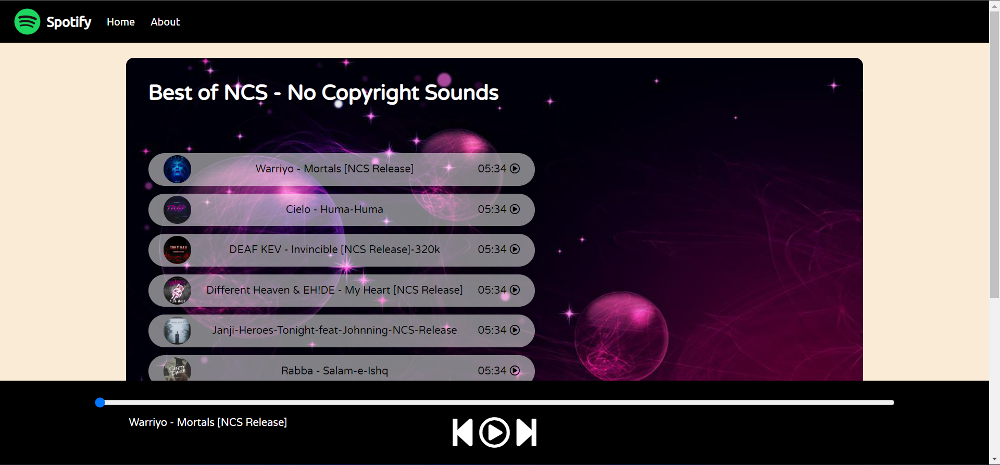

<!-- Social Links -->
[![LinkedIn][linkedin-shield]][linkedin-url]
[![Instagram][instagram-shield]][instagram-url]
[![Twitter][twitter-shield]][twitter-url]

# Spotify-Clone

### Some of screen-shots of my shopify-clone website.

<!-- Add Screenshot of project -->

---

### 👇Live Demo

<!-- Add Live Link -->
[Link](#)

---

# 📋Features

- There is a one impressive feature's is you can play any song and anywhere.

---

# 🛠️Technologies used

- HTML
- CSS
- JavaScript

---

#### Project Link: [GitHub](#)

<!-- Linkedin -->

[linkedin-shield]: https://img.shields.io/badge/-LinkedIn-black.svg?style=for-the-badge&logo=linkedin&colorB=0B5FBB
[linkedin-url]: #add-link-of-linkedin

<!-- Instagram -->

[instagram-shield]: https://img.shields.io/badge/Instagram-%23E4405F.svg?style=for-the-badge&logo=Instagram&logoColor=white
[instagram-url]: #add-link-of-instagram

<!-- Twitter -->

[twitter-shield]: https://img.shields.io/badge/Twitter-%231DA1F2.svg?style=for-the-badge&logo=Twitter&logoColor=white
[twitter-url]: #add-link-of-twitter

